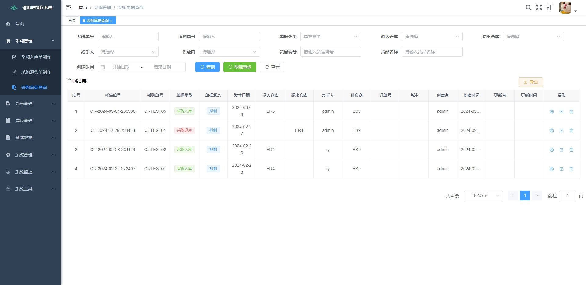

<h1 align="center" style="margin: 30px 0 30px; font-weight: bold;">铠思进销存系统 v1.0.1</h1>
<h4 align="center">基于SpringBoot+Vue前后端分离的Java快速开发框架</h4>

## 平台简介

铠思进销存系统是一套开源的商用进销存系统，用于中小公司系统转型。

* 前端采用Vue3、Element PLUS。
* 后端采用Spring Boot、Spring Security、Redis & Jwt。
* 权限认证使用Jwt，支持多终端认证系统。
* 支持加载动态权限菜单，多方式轻松权限控制。
* 高效率开发，使用代码生成器可以一键生成前后端代码。

## 默认登录账号

* 账号：admin
* 密码：admin123

## 体验使用

* 体验地址：http://6eccd4c1.r10.vip.cpolar.cn

* 体验账号：person
* 体验密码：tes456123

## 商业版

* 支持定制化进销存系统，合作方案可QQ【508441878】咨询。
* 铠思·繁星系统（进销存财务一体化）开发中，敬请期待。

## 功能亮点

* 销售单据状态分拟制与生效，生效后系统判定为库存出库，避免门店下单与仓库出库信息不对等。
* 库存发生汇总、明细，有效记录货品数据与金额进出数据。
* 页面实时编辑打印模板并支持单据页面调用打印，该技术使用积木报表打印设计器与单据打印结合。
* Excel文件上传页面，具有长期有效期，避免聊天软件寻找历史记录文件困难与过期，供系统内部人员下载查询。
* 针对历史系统的数据迁移困难，支持历史单据批量导入。

## 功能界面

## 内置主要功能

1. 采购入库制作：采购货品购买入库单据制作
2. 采购退库制作：采购货品退款出库单据制作
3. 采购单据查询：采购单据头与货品明细查看
4. 销售出库制作：销售货品出售出库单据制作
5. 销售退库制作：销售货品退货入库单据制作
6. 销售单据查询：销售单据头与货品明细查看
7. 库存入库制作：采购货品购买入库单据制作
8. 库存出库制作：采购货品购买入库单据制作
9. 库存调拨制作：采购货品购买入库单据制作
10. 库存盘点制作：采购货品购买入库单据制作
11. 库存单据查询：销售单据头与货品明细查看
12. 库存发生汇总：货品出入库单据汇总查看
13. 库存发生明细：货品出入库单据明细查看
14. 货品库存查询：货品仓库存量查看
15. 历史单据迁移：支持旧系统历史单据批量导入
16. 供应商资料：供应商基础数据维护
17. 客户资料：客户基础数据维护
18. 仓库资料：仓库基础数据维护
19. 货品资料：货品基础数据维护
20. 货品类型：货品类型基础数据维护
21. 文件共享：文件共享上传与下载
22. 打印设计器：积木报表设计器

## 本地启动环境步骤

1. [VMware17安装Centos7 图文教程](https://blog.csdn.net/weixin_45807466/article/details/134276225)
2. [Centos7开机开启网络并固定IP地址](https://blog.csdn.net/weixin_45807466/article/details/137029183)
3. [Redhat7或Centos7自带Yum源卸载并安装国内Yum源](https://blog.csdn.net/weixin_45807466/article/details/115397778)
4. [Centos7下docker安装Mysql与Redis](https://blog.csdn.net/weixin_45807466/article/details/137208441)
5. 需执行jimureport.mysql5.7.create.sql与ks_20240320.sql
6. 替换Mysql与Redis配置IP
7. 前端：ks-vue3目录下输入'npm install','npm run dev'
8. 后端：ruoyi-admin→src→main→java→com→ruoyi→web→启动RuoYiApplication

## docker部署生产环境步骤

* [【全网唯一】Centos7从VMware搭建到Docker安装Jenkins部署Vue与Springboot生产环境全流程](https://blog.csdn.net/weixin_45807466/article/details/137029386)
* [VMware17安装Centos7 图文教程](https://blog.csdn.net/weixin_45807466/article/details/134276225)
* [Centos7开机开启网络并固定IP地址](https://blog.csdn.net/weixin_45807466/article/details/137029183)
* [Redhat7或Centos7自带Yum源卸载并安装国内Yum源](https://blog.csdn.net/weixin_45807466/article/details/115397778)
* [Centos7安装Docker与Docker-compose【图文教程】](https://blog.csdn.net/weixin_45807466/article/details/137029322)
* [Centos7下docker安装Mysql与Redis](https://blog.csdn.net/weixin_45807466/article/details/137208441)
* [Centos7下docker安装jenkins【使用docker-compose图文教程】](https://blog.csdn.net/weixin_45807466/article/details/137061237)
* [Centos7下docker的jenkins配置启动vue、springboot生产环境](https://blog.csdn.net/weixin_45807466/article/details/137029371)

## 铠思进销存系统交流群

QQ群：753620953 欢迎入群交流。

## 常见问题解决方案

### 1、本地环境启动功能页面跳转空白处理

目录：ks-vue3/src/layout/components/AppMain.vue
操作：只置灰< transition > < /transition >